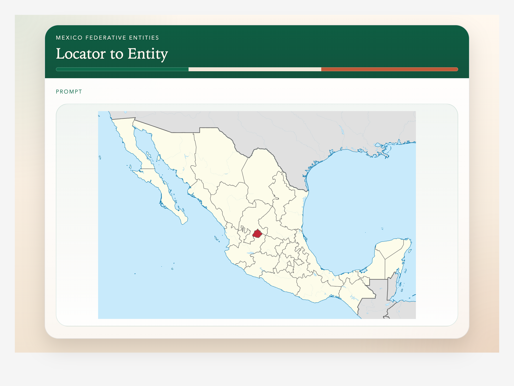
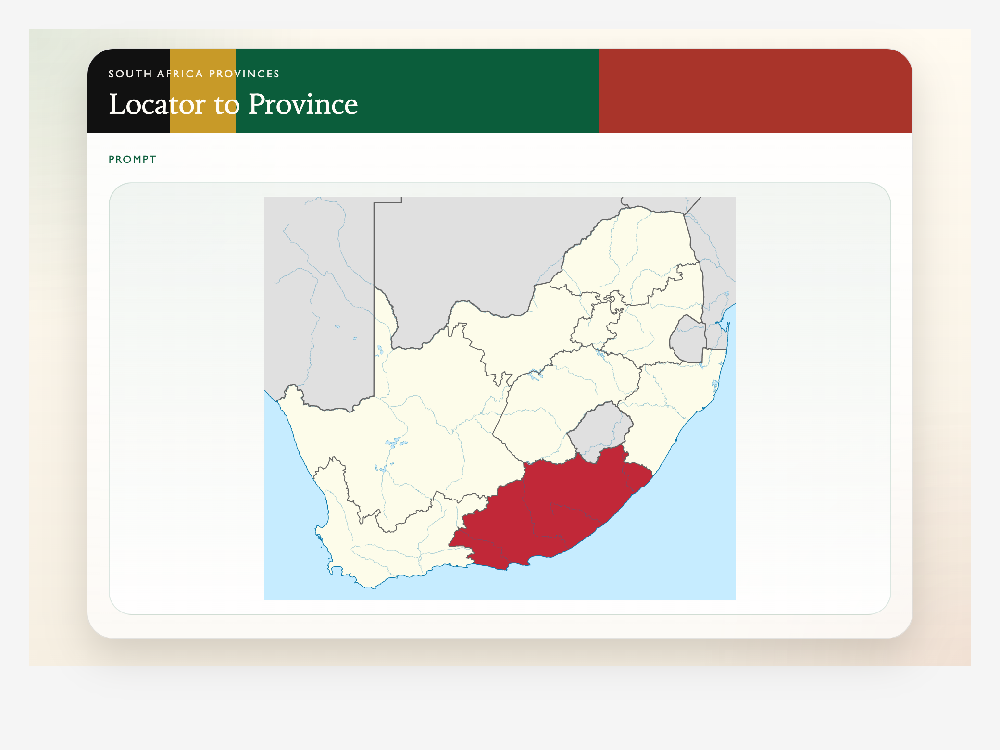
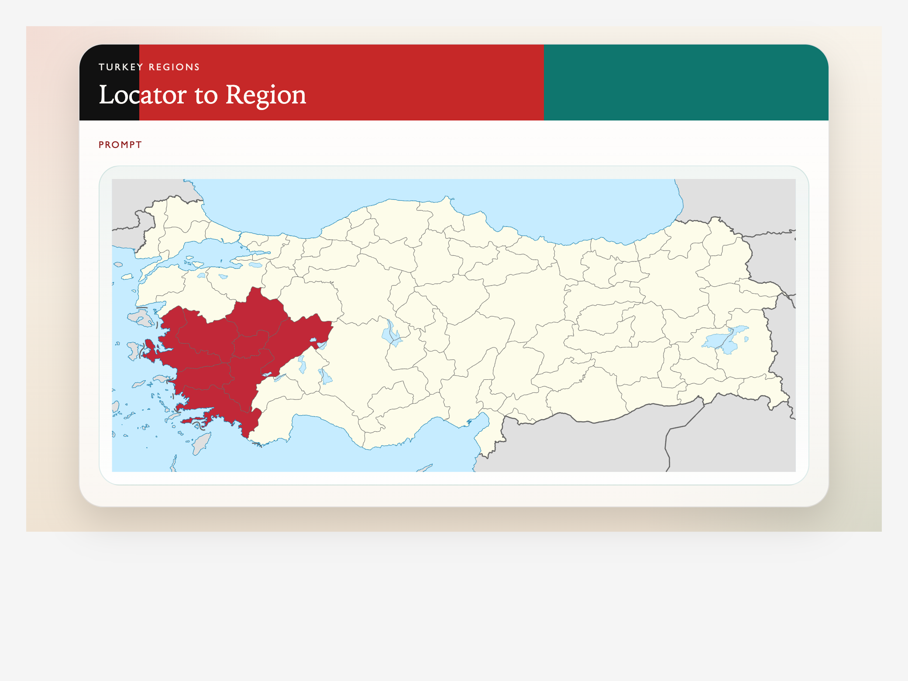
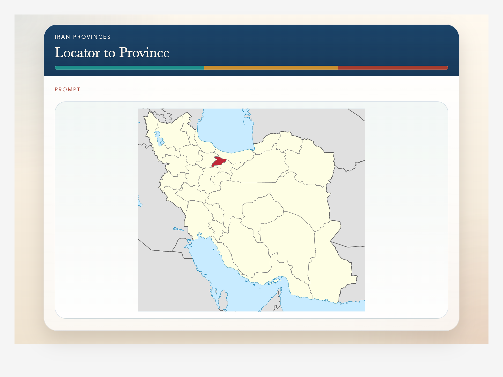

# country-subdivision-map-decks

[](https://github.com/ritornello-labs/country-subdivision-map-decks/actions/workflows/anki-workbench.yml)
[](#download)

[](LICENSE)

Deck-building workspace for first-level country subdivision geography decks.

| Mexico | South Africa |
| --- | --- |
|  |  |
| Turkey | Iran |
|  |  |

Current active countries:

- Mexico
- South Africa
- Turkey
- Iran

## Download

Install the shared decks from AnkiWeb:

- [Mexico Federative Entities: Map Cards](https://ankiweb.net/shared/info/1177438513)
- [South Africa Provinces: Map Cards](https://ankiweb.net/shared/info/1910958626)
- [Turkey Regions: Map Cards](https://ankiweb.net/shared/info/1207470716)
- [Iran Provinces: Map Cards](https://ankiweb.net/shared/info/1452052368)

## Data

Canonical subdivision seed CSVs live in `data/subdivisions/`.

The main fetch script is:

- `scripts/fetch_subdivision_data.py`

## Build setup

```sh
uv sync --extra deck
```

## Deck builds

Build the South Africa package:

```sh
.venv/bin/python scripts/build_south_africa_apkg.py
```

Output:

- `out/south-africa-provinces.apkg`

Build the Mexico package:

```sh
.venv/bin/python scripts/build_mexico_apkg.py
```

Output:

- `out/mexico-federative-entities.apkg`

Turkey now also has a country-specific builder because its seven geographical regions do not have official capitals.

Build the Turkey package:

```sh
.venv/bin/python scripts/build_turkey_apkg.py
```

Output:

- `out/turkey-regions.apkg`

Build the Iran package:

```sh
.venv/bin/python scripts/build_iran_apkg.py
```

Output:

- `out/iran-provinces.apkg`

## Lessons

Project notes from the implemented deck passes live in:

- `LESSONS.md`

## License

Repository code and documentation are MIT licensed. Source maps and subdivision data keep their upstream licenses and attribution requirements as documented in `maps/README.md` and the data manifests.
